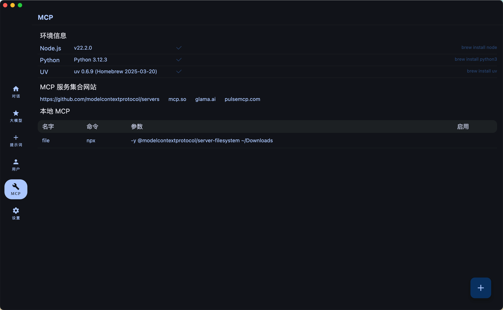

# Deep-Co

<p align="center">
<kbd>
  
</kbd>
  <br>
  <br>
  
  
  
  <br>
  
  
  <br>
  
  
  <br>
  
  
  
</p>


A Chat Client for LLMs, written in Compose Multiplatform. Target supports API providers such as OpenRouter, Anthropic, Grok, OpenAI, DeepSeek,
Coze, Dify, Google Gemini, etc. You can also configure any OpenAI-compatible API or use native models via LM Studio/Ollama.


## Release

[v1.0.5](https://github.com/succlz123/DeepCo/releases)


## Feature

- [x] Desktop Platform Support(Windows/MacOS/Linux)
- [ ] Mobile Platform Support(Android/iOS)
- [x] Chat(Stream&Complete) / Chat History
- [ ] Chat Messages Export / Chat Translate Server
- [x] Prompt Management / User Define
- [x] SillyTavern Character Adaptation(PNG&JSON)
- [x] DeepSeek LLM / Grok LLM / Google Gemini LLM
- [ ] Claude LLM / OpenAI LLM / OLLama LLM
- [ ] Online API polling
- [x] MCP Support
- [ ] MCP Server Market
- [ ] RAG
- [x] TTS(Edge API)
- [ ] Dark/Light Theme
- [x] i18n(Chinese/English) / App Theme

### Chat With LLMs


### Config Your LLMs API Key


### Prompt Management


### Chat With Tavern Character


### User Management


### Config MCP Servers



### Setting


## Model Context Protocol (MCP) ENV

### MacOS

``` 
brew install uv
brew install node
```

### windows

```
winget install --id=astral-sh.uv  -e
winget install OpenJS.NodeJS.LTS
```

## Build

### Run desktop via Gradle

```
./gradlew :desktopApp:run
```

### Building desktop distribution

```
./gradlew :desktop:packageDistributionForCurrentOS
# outputs are written to desktopApp/build/compose/binaries
```

### Run Android via Gradle

```
./gradlew :androidApp:installDebug
```

### Building Android distribution

```
./gradlew clean :androidApp:assembleRelease
# outputs are written to androidApp/build/outputs/apk/release
```

## Thanks

- [Compose-Multiplatform](https://github.com/JetBrains/compose-multiplatform)
- [MCP-Kotlin-SDK](https://github.com/modelcontextprotocol/kotlin-sdk)
- [DeepSeek](https://api-docs.deepseek.com/zh-cn/)
- [HyperChat](https://github.com/BigSweetPotatoStudio/HyperChat)
- [SillyTavern](https://github.com/SillyTavern/SillyTavern)